# School Database — Entity Relationship Diagram

22 tables across eight domains. `grade_scale` is a standalone lookup table with no
foreign keys — the report-card view joins it on a percentage range rather than an id.

Two relationships in the diagram are worth calling out because they are cycles:

- `teachers.mentor_teacher_id → teachers.teacher_id` (self-reference)
- `teachers.department_id → departments` **and** `departments.head_teacher_id → teachers`
  (mutual reference; the second constraint is `DEFERRABLE INITIALLY DEFERRED`)

```mermaid
erDiagram
    departments ||--o{ teachers               : employs
    teachers    ||--o| departments            : heads
    teachers    ||--o{ teachers               : mentors
    departments ||--o{ subjects               : offers

    academic_years ||--o{ terms               : "is divided into"
    academic_years ||--o{ class_sections      : schedules
    grade_levels   ||--o{ class_sections      : "is taught as"
    teachers       ||--o{ class_sections      : "is homeroom for"

    class_sections ||--o{ students            : hosts
    students       ||--o{ student_guardians   : "is contacted via"
    guardians      ||--o{ student_guardians   : "is contact for"

    subjects       ||--o{ courses             : "is delivered as"
    class_sections ||--o{ courses             : receives
    teachers       ||--o{ courses             : teaches
    students       ||--o{ enrollments         : takes
    courses        ||--o{ enrollments         : "is taken by"

    courses        ||--o{ exams               : assesses
    terms          ||--o{ exams               : "is scheduled in"
    exams          ||--o{ exam_results        : produces
    students       ||--o{ exam_results        : earns
    teachers       ||--o{ exam_results        : grades

    students       ||--o{ attendance          : "is marked in"
    class_sections ||--o{ attendance          : registers
    teachers       ||--o{ attendance          : records

    teachers       ||--o{ activities            : coordinates
    students       ||--o{ activity_participants : "takes part in"
    activities     ||--o{ activity_participants : enrolls

    students       ||--o{ invoices            : "is billed by"
    academic_years ||--o{ invoices            : covers
    terms          ||--o{ invoices            : covers
    invoices       ||--o{ invoice_items       : "is itemised as"
    fee_types      ||--o{ invoice_items       : classifies
    invoices       ||--o{ payments            : "is settled by"

    departments {
        int         department_id  PK
        varchar     name           UK
        varchar     code           UK
        int         head_teacher_id FK "to teachers, deferrable"
        varchar     office_room
        numeric     annual_budget
        timestamptz created_at
    }

    teachers {
        int             teacher_id        PK
        varchar         employee_no       UK
        varchar         first_name
        varchar         last_name
        varchar         email             UK
        varchar         phone
        date            date_of_birth
        date            hire_date
        int             department_id     FK "to departments"
        int             mentor_teacher_id FK "self-reference"
        employment_type employment
        numeric         annual_salary
        boolean         is_active
    }

    subjects {
        int      subject_id    PK
        varchar  code          UK
        varchar  name
        int      department_id FK "to departments"
        smallint credit_hours
        boolean  is_elective
        text     description
    }

    academic_years {
        int     academic_year_id PK
        varchar name             UK "e.g. 2025-2026"
        date    start_date
        date    end_date
        boolean is_current          "partial unique index: only one true"
    }

    terms {
        int      term_id          PK
        int      academic_year_id FK "to academic_years"
        varchar  name
        smallint term_number         "unique per year"
        date     start_date
        date     end_date
    }

    grade_levels {
        int      grade_level_id PK
        smallint level_number   UK "1 to 12"
        varchar  label
        varchar  stage             "primary, middle or secondary"
    }

    class_sections {
        int      class_section_id    PK
        int      academic_year_id    FK "to academic_years"
        int      grade_level_id      FK "to grade_levels"
        char     section_label          "unique with year and grade"
        int      homeroom_teacher_id FK "to teachers"
        varchar  room_number
        smallint capacity
    }

    students {
        int            student_id               PK
        varchar        admission_no             UK
        varchar        first_name
        varchar        last_name
        date           date_of_birth
        gender_type    gender
        varchar        email                    UK
        varchar        phone
        varchar        address_line
        varchar        city
        varchar        postal_code
        date           admission_date
        student_status status
        int            current_class_section_id FK "to class_sections"
        timestamptz    created_at
    }

    guardians {
        int     guardian_id PK
        varchar first_name
        varchar last_name
        varchar email
        varchar phone
        varchar occupation
        varchar address_line
        varchar city
    }

    student_guardians {
        int                   student_id   PK "also FK to students"
        int                   guardian_id  PK "also FK to guardians"
        guardian_relationship relationship
        boolean               is_primary
    }

    courses {
        int      course_id        PK
        int      subject_id       FK "to subjects"
        int      class_section_id FK "to class_sections"
        int      teacher_id       FK "to teachers"
        smallint weekly_periods
        varchar  room_number
    }

    enrollments {
        int               student_id  PK "also FK to students"
        int               course_id   PK "also FK to courses"
        date              enrolled_on
        enrollment_status status
        numeric           final_score    "weighted percent, 0 to 100"
    }

    grade_scale {
        int     grade_scale_id PK
        varchar letter         UK
        numeric min_percent
        numeric max_percent
        numeric gpa_points
        boolean is_passing
    }

    exams {
        int       exam_id        PK
        int       course_id      FK "to courses"
        int       term_id        FK "to terms"
        varchar   title
        exam_type exam_type
        date      exam_date
        numeric   max_score
        numeric   weight_percent
    }

    exam_results {
        bigint      exam_result_id PK
        int         exam_id        FK "to exams, unique with student"
        int         student_id     FK "to students"
        numeric     score             "null when absent"
        boolean     is_absent
        int         graded_by      FK "to teachers"
        timestamptz graded_at
        varchar     remarks
    }

    attendance {
        bigint            attendance_id    PK
        int               student_id       FK "to students, unique with date"
        int               class_section_id FK "to class_sections"
        date              attendance_date
        attendance_status status
        int               recorded_by      FK "to teachers"
        varchar           note
    }

    activities {
        int               activity_id            PK
        varchar           name                   UK
        activity_category category
        int               coordinator_teacher_id FK "to teachers"
        varchar           meeting_day
        time              meeting_time
        varchar           location
        smallint          max_participants
        numeric           annual_fee
    }

    activity_participants {
        int     student_id  PK "also FK to students"
        int     activity_id PK "also FK to activities"
        date    joined_on
        varchar role
        boolean is_active
    }

    fee_types {
        int     fee_type_id    PK
        varchar code           UK
        varchar name
        numeric default_amount
        boolean is_recurring
        text    description
    }

    invoices {
        int            invoice_id       PK
        varchar        invoice_no       UK
        int            student_id       FK "to students"
        int            academic_year_id FK "to academic_years"
        int            term_id          FK "to terms"
        date           issue_date
        date           due_date
        numeric        total_amount
        invoice_status status
    }

    invoice_items {
        bigint   invoice_item_id PK
        int      invoice_id      FK "to invoices"
        int      fee_type_id     FK "to fee_types"
        varchar  description
        smallint quantity
        numeric  unit_amount
        numeric  line_total         "generated: quantity * unit_amount"
    }

    payments {
        bigint         payment_id   PK
        int            invoice_id   FK "to invoices"
        date           paid_on
        numeric        amount
        payment_method method
        varchar        reference_no UK
        varchar        received_by
        varchar        note
    }
```

## Enumerated types

| Type | Values |
| --- | --- |
| `gender_type` | male, female, other, undisclosed |
| `employment_type` | full_time, part_time, contract, visiting |
| `student_status` | active, graduated, transferred, withdrawn, suspended |
| `enrollment_status` | enrolled, completed, dropped |
| `guardian_relationship` | mother, father, grandparent, sibling, legal_guardian, other |
| `exam_type` | quiz, midterm, final, practical, project |
| `attendance_status` | present, absent, late, excused |
| `activity_category` | sports, arts, academic, service, music, technology |
| `invoice_status` | draft, issued, partially_paid, paid, overdue, cancelled |
| `payment_method` | cash, card, bank_transfer, cheque, online |

## Views

| View | Grain | Notes |
| --- | --- | --- |
| `v_student_report_card` | student × course | Weighted average across the term's quiz (30%) and exam (70%), matched to `grade_scale` on percentage range. |
| `v_outstanding_fees` | student × academic year | Invoiced minus paid, filtered to non-zero balances. |
